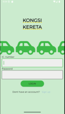
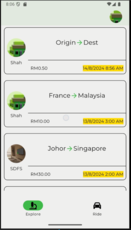
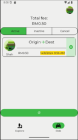

# wsmb_rider

Kongsi Kereta is an eco-friendly ride-sharing app that brings people together through carpooling, designed for a cleaner, greener future. Like Grab, it connects riders with drivers — but with a twist: it’s focused entirely on green, shared transportation to reduce traffic and carbon emissions.

Built with Firebase for real-time updates and user management, Kongsi Kereta ensures a smooth, secure, and scalable experience. The app features a nature-focused, calming UI that reflects its mission: promoting sustainability through everyday travel.

## Demo Video
🎵🎵Armando Trovajoli - L'amore dice ciao

https://github.com/user-attachments/assets/4139e97c-6d1a-4161-9367-fcb95f38f998

